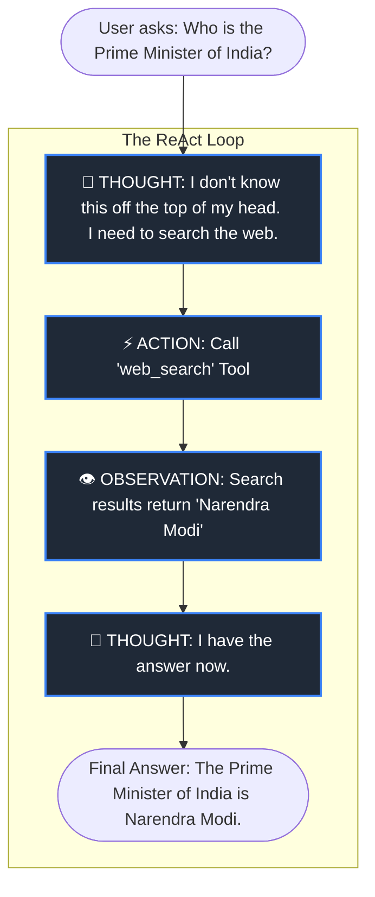

# Demystifying AI Agents: The "Hello Agent" Guide 🤖

Welcome to the world of AI Agents! If you've ever used ChatGPT, you know that AI can answer questions. But an **AI Agent** takes this a step further: it doesn't just talk—it **thinks, plans, and takes action**. 

This document will break down what an AI Agent is, how it works, and how the `hello_agent` project you just built implements these concepts. We have written this specifically for non-engineers looking to build a career in AI.

---

## 1. What is an AI Agent?

Imagine you ask a normal chatbot: *"What is the weather in Copenhagen today?"* 
A normal chatbot might say: *"I don't know, my training data ended in 2023."*

If you ask an **AI Agent** the same question, it acts like a human assistant:
1. **Thought:** "I need to check the current weather for Copenhagen. I will use the internet."
2. **Action:** *Uses a search tool to look up Copenhagen's weather.*
3. **Observation:** *Sees that it is 18°C and rainy.*
4. **Final Answer:** *"It's currently 18°C and rainy in Copenhagen!"*

> [!NOTE]
> **The Core Difference:** 
> A standard AI model generates text based on patterns. An AI **Agent** is given **Tools** (like a calculator, web search, or database access) and the autonomy to use them to solve problems.

---

## 2. The Anatomy of an AI Agent

Every effective AI agent requires three main components. Think of it like building a digital employee.

### 🧠 1. The Brain (The LLM)
The agent needs a Large Language Model (like Google Gemini or OpenAI GPT-4) to process language, understand the user's intent, and make logical decisions.

### 🧰 2. The Hands (Tools)
Tools are the applications the agent can use to interact with the real world. In `hello_agent`, we gave the agent three tools:
- **Calculator**: To do math accurately.
- **Web Search**: To look up real-time information.
- **Weather API**: To check the forecast.

### 💾 3. The Notebook (Memory)
To hold a conversation, the agent needs to remember what was said five minutes ago. 
- **Short-term memory**: Remembering the current chat session.
- **Long-term memory**: Remembering facts about the user across different days.

---

## 3. How it Works: The ReAct Loop

The secret sauce of modern AI agents is the **ReAct (Reasoning + Acting) Loop**. It forces the AI to stop and think out loud before doing anything. 

Here is a visual representation of how the `hello_agent` thinks:

As long as the agent needs more information, it will continue cycling through Thought → Action → Observation. 

---

## 4. Mapping Concepts to the `hello_agent` Codebase

Now that you understand the concepts, let's look at how the code you built in `hello_agent` actually works. If you ever want to expand this project, you now know exactly where to look!

| Concept | File in Project | What it does |
| :--- | :--- | :--- |
| **The Loop** | `agent/core.py` | This is the engine room. It contains the exact code that forces the AI to output "Thought:", "Action:", and "Final Answer:". |
| **Memory** | `agent/memory.py` | This keeps track of the chat history so the AI doesn't get amnesia after every message. |
| **The Tools** | `agent/tools/` | This folder holds the agent's capabilities. Want the agent to send emails? You would create `agent/tools/email.py` and register it here! |
| **The Body** | `api/server.py` & `web/` | This provides the beautiful user interface so humans can interact with the agent easily. |

> [!TIP]
> **Career Advice for AI Builders:**
> You don't need to invent new AI models to be valuable in the AI industry. The future belongs to people who know how to take existing models (like Gemini) and wire them up with tools, memory, and ReAct loops to solve real-world business problems.

---

## 5. Summary

Building an AI agent is simply taking a smart chatbot and giving it a strict framework (the **ReAct loop**) and a set of instructions (**Tools**) to interact with the outside world. By exploring and modifying the `hello_agent` project, you now possess the foundational blueprint used by top tech companies to build autonomous AI systems.
