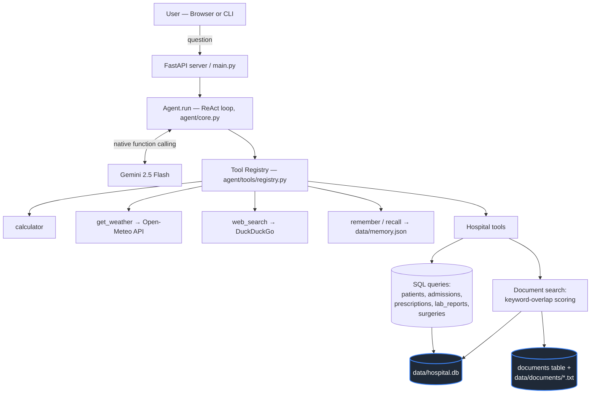
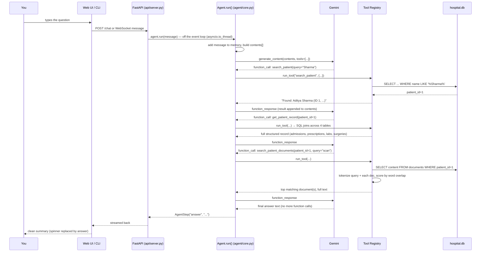

# Hospital Tool & RAG — Architecture Guide

This document explains the hospital records + document-search (RAG) system built on top of `hello_agent`: what it is, what happens end-to-end when you ask a question, how the RAG layer actually retrieves information, and how to extend it with real data later (including real PDFs).

For the general agent framework (ReAct loop, tool registry, memory), see [AI_AGENT_GUIDE.md](AI_AGENT_GUIDE.md) first — this document assumes you understand that foundation and focuses specifically on the hospital/RAG layer built on top of it.

---

## 1. What This Architecture Is

There is **one agent** (Darshan-AI) with **one brain** (Gemini). Everything it can do — math, weather, web search, remembering facts, and now hospital records — is a **tool**. The agent doesn't have separate "modes" for different domains; it just sees a list of available functions and decides which ones to call based on your question.

The hospital capability adds **two different kinds of memory** to that toolset:

| Layer | What it stores | How it's queried | Tools |
|---|---|---|---|
| **Structured records** (SQL) | Facts with a fixed shape: names, dates, medicine names, lab values | Exact SQL queries — precise, fast, always correct if the data exists | `list_patients`, `search_patient`, `get_patient_record` |
| **Unstructured documents** (RAG) | Free-text narrative: discharge summaries, scan reports, doctor's notes | Keyword-overlap search — approximate, finds *relevant* text, doesn't guarantee an exact match | `list_patient_documents`, `search_patient_documents` |

Both live in **one SQLite file**, `data/hospital.db`, with the document *text* also duplicated as real `.txt` files under `data/documents/` (a stand-in for how you'd store scanned/uploaded PDFs).

> **Not to be confused with:** `data/memory.json` (the file you had open) is a *completely separate* system — the agent's general "remember this fact about the user" long-term memory (`remember_tool.py`), used for things like "remember my favorite color is teal." It has nothing to do with patient records. Three independent stores, one agent:
> - `data/memory.json` → general assistant facts (key/value)
> - `data/hospital.db` (SQL tables) → structured patient records
> - `data/hospital.db` (`documents` table) + `data/documents/*.txt` → unstructured clinical notes (RAG)

---

## 2. Component Map



Nothing here is hardcoded to "know about" hospitals at the framework level — `agent/core.py` has zero hospital-specific code. It just runs the same ReAct loop, and Gemini decides when the hospital tools are relevant based on their `description` text (see `agent/tools/hospital.py`).

---

## 3. What Happens When You Ask a Question — Step by Step

Take a concrete example: *"Summarize Sharma's medical history, including anything from scans."*



Key things worth noticing:

- **Every step is a real round-trip to Gemini.** The model decides *for itself* to call `search_patient` first, then `get_patient_record`, then `search_patient_documents` — nothing in the code hardcodes that sequence. Ask a simpler question ("what's patient 1's blood group?") and it might call only `get_patient_record`, or even just `search_patient` if that already contains the answer.
- **Tool calls are structured, not text-parsed.** Since the earlier refactor to Gemini's native function-calling API, arguments like `{"patient_id": 1}` arrive as already-validated JSON — the model never has to "write" a function call as text that could get mangled.
- **The web UI hides all of this by design.** You only see a spinner with a rotating status ("Using search_patient…" → "Using get_patient_record…" → …) and then the final answer — the full trace above still happens, just not rendered per-step (see `web/app.js`).

---

## 4. How to Ask Questions (the interfaces)

| Surface | How | Notes |
|---|---|---|
| **Web UI** | `docker compose up -d` → http://localhost:8000, type in the chat box | Real-time streaming via WebSocket, spinner + clean final answer |
| **REST** | `POST /chat {"message": "..."}` | Returns the full step trace + final answer as JSON — good for debugging or scripting |
| **CLI** | `python main.py` or `python main.py --message "..."` | Same agent, terminal output, shows every ReAct step by default |
| **Dedicated report endpoint** | `GET /patients/{id}/summary` | Skips the chat entirely — runs a fixed prompt through a **fresh, memory-less** agent instance and returns just `{patient_id, summary}`. Built for Phase 4 (AI-generated summaries) as a stateless report, not a conversation turn. |

Some example questions and what they trigger:

| You ask | Tools it (likely) calls | Layer |
|---|---|---|
| "List the patients" | `list_patients` | SQL |
| "Find John Smith" | `search_patient` | SQL |
| "What medications is patient 5 on?" | `get_patient_record` | SQL |
| "Any doctor's notes about fatigue for patient 3?" | `search_patient_documents` | RAG |
| "What documents exist for patient 12?" | `list_patient_documents` | SQL (metadata about documents) |
| "Summarize patient 1's full history" | `get_patient_record` **+** `search_patient_documents` | Both, combined by the LLM |

---

## 5. RAG Integration — How It Actually Works

**RAG** (Retrieval-Augmented Generation) means: instead of letting the LLM *invent* clinical details from its training data (which would be fabrication for patient-specific facts), the agent **retrieves real text first** and hands it to the model as grounding — the model's job becomes summarizing/synthesizing what it was given, not making things up.

### The retrieval method used here: keyword overlap (not embeddings)

`search_patient_documents(patient_id, query)` in `agent/tools/hospital.py` does this:

1. Pull every document row for that patient from the `documents` table.
2. Tokenize the query and each document's content: lowercase, split into words, drop short/common words (`_STOPWORDS` — "the", "and", "patient", etc.).
3. Score each document by **how many tokens overlap** between the query and that document (simple set intersection).
4. Return the top 3 highest-scoring documents, full text, or a clear "no match" message with a list of what *is* available.

```python
def _tokenize(text: str) -> set:
    words = re.findall(r"[a-z0-9]+", text.lower())
    return {w for w in words if len(w) > 2 and w not in _STOPWORDS}

overlap = len(query_words & _tokenize(document_content))
```

### Why this approach, not a vector database

This is deliberately **not** using embeddings + a vector DB (e.g. ChromaDB, Pinecone) — that's the more "standard" way to build RAG in production, but for this project it would mean:

- A new heavy dependency (embedding model, often hundreds of MB)
- A network download of that model on first use — this sandbox has already shown flaky network access; a silent failure there would be a bad demo experience
- Real cost/latency for a 45-document corpus that doesn't remotely need it

Keyword overlap is a legitimate classic IR (information retrieval) baseline — it's exactly what full-text search engines did before embeddings became cheap — and for a POC-sized document set it works well and fails predictably.

### Where it breaks down (and when to upgrade)

| Limitation | Symptom | Fix |
|---|---|---|
| No semantic matching | Query "cardiac issue" won't match a document that only says "heart condition" | Move to embeddings (see below) |
| No chunking | Whole documents are returned as-is | Fine while documents stay short (a few hundred words); split into passages if documents get long |
| Scales linearly, no index | Every search scans all of one patient's documents | Fine at this scale (≤10 docs/patient); would need a real index (SQLite FTS5, or a vector DB) past a few hundred documents per patient |

---

## 6. Adding Future Data

### 6a. More synthetic patients / documents (zero-effort)

`agent/tools/hospital.py` seeds data from a fixed random seed. To generate more:

```python
_PATIENT_COUNT = 25   # bump this, delete data/hospital.db, restart — it reseeds automatically
```

Seeding is **idempotent per table** — if you only add a new table later, existing patient data is left alone and just the new table gets seeded (this is how `documents` was added without disturbing already-seeded patients in this project).

### 6b. Real PDF documents (the actual "PDF upload" path)

Right now, "documents" are synthetic `.txt` files with content also duplicated into the DB. To support real PDFs:

1. **Add a PDF text-extraction step.** `pypdf` or `pdfplumber` (both pure-Python, lightweight) can extract text from a PDF:
   ```python
   from pypdf import PdfReader
   text = "\n".join(page.extract_text() for page in PdfReader(pdf_path).pages)
   ```
2. **Add an ingestion tool**, e.g. `agent/tools/hospital.py::ingest_document(patient_id, file_path, document_type)`:
   - Extract text via the above
   - Insert a row into `documents` (same schema already in place: `document_type`, `title`, `content`, `file_path`, `created_date`)
   - Copy/keep the original PDF under `data/documents/` and store its path in `file_path` (today `file_path` points at a `.txt`; for real PDFs it would point at the original `.pdf`, with `content` holding the extracted text used for search)
3. **Expose it** — either as a new `@tool()` (so the agent itself can be told "here's a new file, add it") or, more realistically for a hospital app, as a plain REST endpoint in `api/server.py` (`POST /patients/{id}/documents` with a file upload) that calls the same ingestion function directly — uploading a document isn't something you'd want the LLM deciding to do mid-conversation.
4. **Scanned (image) PDFs** need OCR first (e.g. `pytesseract` over page images) before step 1 — a real "scan report" upload flow would check whether the PDF has embedded text and fall back to OCR if not.

None of this changes `search_patient_documents` — it already works over whatever's in the `content` column, so real PDF text slots into the exact same retrieval path with no changes.

### 6c. Upgrading retrieval to embeddings (when the corpus grows)

If you eventually have hundreds of documents per patient (or need semantic matching), swap the scoring function, not the architecture:

```python
# Conceptually — replace _tokenize()/overlap scoring with:
embedding = embed_model.encode(query)              # e.g. sentence-transformers
doc_embeddings = [embed_model.encode(d.content) for d in docs]
scores = cosine_similarity(embedding, doc_embeddings)
```

A vector DB (ChromaDB is the natural fit — lightweight, embeddable, no separate server process) would replace the manual scoring loop with an indexed similarity search. This is a **localized change** inside `search_patient_documents` — the tool's name, description, and inputs/outputs to the agent stay identical, so nothing else in the system needs to know retrieval got smarter.

### 6d. New structured tables (Doctors, Appointments, Billing)

The original design sketch included these as "Future" — they follow the exact same pattern as the five tables already built: add a `CREATE TABLE` block to `_SCHEMA`, a `_seed_*()` function, and one or two `@tool()`-decorated query functions in `hospital.py`. No changes anywhere else — the agent auto-discovers new tools the moment they're registered.

---

## 7. Current Limitations (by design, for a POC)

- **All data is synthetic** — fixed random seed, fake names/values, regenerated from scratch each time the DB is deleted.
- **No authentication** — anyone who can reach the API can query any patient. Real deployment needs auth + role-based access control (this was explicitly scoped out as "Phase 6" and deferred).
- **No encryption at rest** — `hospital.db` is plain SQLite.
- **Single shared chat agent** — the `/chat` and `/ws` conversation memory is one process-wide instance; the `/patients/{id}/summary` endpoint deliberately avoids this by spinning up a fresh `Agent()` per call.

See the README's Hospital Tool section for the same warning in context of the rest of the project.
