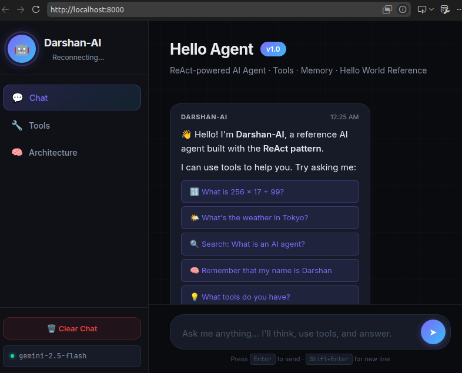

# Darshan-AI 🩺 — Hospital Assistant
### A focused healthcare AI agent, and a reference for how production agents are built

[](https://python.org)
[](https://fastapi.tiangolo.com)
[](https://aistudio.google.com)
[](https://docker.com)

> A real, working hospital assistant — patient records, a doctor directory with live availability,
> RAG-powered clinical document search, and voice-enabled chat — built the same way production
> agents are built at **Google**, **Amazon**, and **OpenAI**. Also a clean reference for the ReAct
> pattern if you want to learn how agents like this work under the hood.

New to AI agents? Read **[AI_AGENT_GUIDE.md](AI_AGENT_GUIDE.md)** first — a plain-language walkthrough of the concepts.

---

## 🧠 What Is an AI Agent?

An AI agent is a program that:
1. **Perceives** — receives input (user messages, sensor data, etc.)
2. **Reasons** — uses an LLM to plan what to do
3. **Acts** — calls tools (APIs, databases, code runners)
4. **Observes** — sees the result and updates its understanding
5. **Repeats** — loops until it has a final answer

This project implements the **ReAct pattern** (Reasoning + Acting), which is the foundation of:
- OpenAI's Assistants API
- LangChain's AgentExecutor
- Amazon Bedrock Agents
- Google Vertex AI Agents

---

## ✨ Features

| Feature | Details |
|---|---|
| 🔄 **ReAct Loop** | Full think → act → observe → repeat cycle, with multi-tool chaining |
| 🧠 **Real LLM** | Google Gemini 2.5 Flash **or** Groq (`openai/gpt-oss-120b`) — swap providers with one `.env` line |
| 🔍 **Live Web Search** | Real DuckDuckGo search — no API key needed |
| 🌤️ **Live Weather** | Real Open-Meteo data for any city — no API key needed |
| 🏥 **Patient Records (POC)** | SQLite-backed records + RAG document search — synthetic data only, see note below |
| 🩺 **Doctor Directory (POC)** | Specialties, qualifications, live weekly availability, recently consulted patients |
| 🔧 **Tool System** | Add any function as a tool with the `@tool()` decorator |
| 💾 **Memory** | Short-term (conversation) + long-term (JSON, survives restarts) |
| 🌐 **Web UI** | Light clinical chat interface — spinner while thinking, clean final answers |
| 🎤 **Voice Input** | Speak instead of typing — browser-native speech-to-text, no server round trip |
| ⏹️ **Cancel Requests** | Send button becomes a stop button while the agent is working — cancel a request mid-flight |
| 🖥️ **CLI** | Rich terminal interface for testing |
| ⚡ **WebSocket** | Real-time streaming from agent to browser |
| 🐳 **Docker Compose** | Entire stack with one command: `docker compose up -d` |
| 📦 **Zero Lock-in** | Pure Python, no LangChain/AutoGen required |

---

## 🚀 Quick Start

### Option A — Docker Compose (Recommended)

```bash
git clone <your-repo-url>
cd hello_agent

# 1. Configure (add your API key)
cp .env.example .env
# Edit .env → set GEMINI_API_KEY=AIzaSy...
# Get a free key: https://aistudio.google.com/apikey

# 2. Start everything (builds automatically on first run)
docker compose up -d
# → Open http://localhost:8000
```

That's it — no Python setup needed on your machine. Or use the shortcut: `make up`.

| Command | What it does |
|---|---|
| `docker compose up -d` | Start the full stack (UI + API) |
| `docker compose up -d --build` | Rebuild after code changes, then start |
| `docker compose logs -f` | Follow the agent's logs live |
| `docker compose ps` | Status (includes healthcheck: `healthy`) |
| `docker compose down` | Stop everything |
| `docker compose run --rm cli` | Interactive chat in the terminal instead |

Long-term memory is persisted in `./data`, so the agent still remembers you after `docker compose down && docker compose up -d`.

---

### Option B — Local Python (no Docker)

```bash
git clone <your-repo-url>
cd hello_agent

# Setup
python -m venv .venv
source .venv/bin/activate
pip install -r requirements.txt

# Configure
cp .env.example .env
# Edit .env → set GEMINI_API_KEY

# Run
make dev           # CLI chat
make dev-server    # Web UI at http://localhost:8000
```

### Run directly (bypassing make)

```bash
python main.py                                  # CLI chat
python main.py --server                         # Web UI at http://localhost:8000
python main.py --message "What is sqrt(256)?"   # Single question, then exit
```

---

## 🐳 Docker & Makefile Reference

### All `make` commands

| Command | What it does |
|---|---|
| `make up` | **Start everything with Docker Compose** (recommended) |
| `make down` | Stop the Compose stack |
| `make build` | Build the Docker image only |
| `make run` | Start web UI (plain `docker run`, no Compose) |
| `make run-cli` | Interactive CLI chat inside Docker |
| `make run-msg MSG="..."` | Send one question, print answer, exit |
| `make stop` | Stop the running container |
| `make logs` | Follow container logs live |
| `make shell` | Open a bash shell inside the container |
| `make rebuild` | Stop → rebuild image → run |
| `make clean` | Remove container and image |
| `make dev` | Run CLI locally (no Docker, uses venv) |
| `make dev-server` | Run web server locally (no Docker) |

### Docker files

```
docker-compose.yml   ← One-command stack: server + optional CLI profile
.dockerignore        ← Keeps build context small (excludes .venv, .git, ...)
docker/
├── Dockerfile       ← Multi-stage build (builder + slim runtime, non-root user)
└── entrypoint.sh    ← Startup script: validates env, picks run mode
```

### Run modes (set via `RUN_MODE` env var)

| Mode | How to use |
|---|---|
| `server` | default — starts the web UI + API |
| `cli` | `docker compose run --rm cli` — interactive terminal chat |
| `message` | `make run-msg MSG="What is 2+2?"` — single question |

---

## 📁 Project Structure

```
hello_agent/
│
├── agent/                    ← CORE AGENT LOGIC
│   ├── core.py               ← ★ THE REACT LOOP (start here!)
│   ├── memory.py             ← Conversation history (sliding window)
│   └── tools/
│       ├── registry.py       ← @tool() decorator system
│       ├── calculator.py     ← Math tool (hardened safe-eval)
│       ├── weather.py        ← LIVE weather via Open-Meteo (no key)
│       ├── web_search.py     ← LIVE search via DuckDuckGo (no key)
│       ├── memory_tool.py    ← Remember/recall facts (persisted)
│       └── hospital.py       ← Patient records (SQLite, synthetic data — POC)
│
├── api/
│   └── server.py             ← FastAPI REST + WebSocket server (non-blocking)
│
├── web/
│   ├── index.html            ← Chat + Patients + Doctors UI
│   ├── style.css             ← Light clinical design
│   └── app.js                ← WebSocket streaming, voice input, patient/doctor panels
│
├── docker/
│   ├── Dockerfile            ← Multi-stage image build
│   └── entrypoint.sh         ← Container startup & validation
│
├── data/                     ← Auto-created, stores long-term memory
│   ├── memory.json
│   └── hospital.db           ← Synthetic patient records (auto-seeded, gitignored)
│
├── docs/
│   └── web-ui.png            ← Screenshot of the web interface
│
├── docker-compose.yml        ← One-command full stack
├── Makefile                  ← make up / down / dev / clean ...
├── config.py                 ← All settings (reads from .env)
├── main.py                   ← CLI entry point
├── requirements.txt
├── .env.example
├── AI_AGENT_GUIDE.md         ← Concepts explained for non-engineers
├── HOSPITAL_RAG_ARCHITECTURE.md ← Hospital tool + RAG deep dive, request flow diagrams
└── README.md                 ← You are here
```

---

## 🔄 The ReAct Loop (Core Concept)

```
User: "What is 2^10?"

Agent thinks:
  Thought: The user wants 2 to the power of 10. I should use the calculator.
  Action: calculator
  Action Input: {"expression": "2 ** 10"}

Tool runs:
  Observation: Result: 1024

Agent thinks:
  Thought: I have the answer.
  Final Answer: 2^10 = 1024
```

This loop is in `agent/core.py`. Read it — it's ~100 lines and teaches you everything.
The agent chains tools too: ask a two-part question and it will call the calculator *and* the weather tool before answering.

---

## 🔧 Adding Your Own Tool

It takes **5 lines**:

```python
# In any file inside agent/tools/
from agent.tools.registry import tool

@tool(
    name="my_tool",
    description="What this tool does — the LLM reads this!",
    parameters={"input": {"type": "string", "description": "The input"}},
)
def my_tool(input: str) -> str:
    return f"Processed: {input}"
```

Then add one import in `agent/tools/__init__.py`:
```python
from agent.tools import my_tool_file
```

That's it. The agent will automatically know about and use your tool.

---

## 🔌 The Data Sources (Already Real!)

Unlike most tutorial projects, the tools here hit **real APIs out of the box** — no extra keys needed:

| Tool | Backend | Upgrade path |
|---|---|---|
| `web_search` | DuckDuckGo via [`ddgs`](https://pypi.org/project/ddgs/) | Swap in [Tavily](https://tavily.com) for higher-quality results (free tier, needs key) |
| `get_weather` | [Open-Meteo](https://open-meteo.com) geocoding + forecast | Already real — any city worldwide |
| LLM | Gemini 2.5 Flash (free tier) **or** Groq (free tier) — see below | `LLM_MODEL=gemini-2.5-pro` in `.env` for a more powerful Gemini model |

**Note on demo mode:** if the active provider's API key is missing or invalid, the agent falls back to a keyword-based mock "brain" so the ReAct loop is still demonstrable — but answers will be canned. With a valid key, everything is real.

### Two LLM providers — switch with one line in `.env`

Gemini's free tier caps `gemini-2.5-flash` at a small number of requests **per day**, not just per minute (Google returns `429 RESOURCE_EXHAUSTED` with `GenerateRequestsPerDayPerProjectPerModel-FreeTier` once hit). Each agent turn can use several requests when it chains tool calls, so this is easy to hit during active testing.

[Groq](https://console.groq.com/keys) offers a free tier with a substantially higher daily request cap, an OpenAI-compatible tools API, and fast inference. Both providers use real structured function calling (`agent/core.py` has a `_run_gemini` and `_run_groq` generator, dispatched by `LLM_PROVIDER`) — same tools, same ReAct loop, same UI.

```bash
# In .env
LLM_PROVIDER=groq
GROQ_API_KEY=gsk_...          # https://console.groq.com/keys (free)
GROQ_MODEL=openai/gpt-oss-120b
```

**On model choice:** not every Groq-hosted model handles multi-step tool calling reliably against this project's schema — `llama-3.3-70b-versatile` and the Llama-4 Scout model both produced malformed or mistyped tool calls (`400 tool_use_failed`, or a string instead of an integer for `patient_id`) in live testing here. `openai/gpt-oss-120b` chained `search_patient` → `get_patient_record` and 3-tool doctor lookups correctly every time — that's why it's the default. If you change `GROQ_MODEL`, re-test a multi-tool question (e.g. *"Search for a patient named Sharma, then summarize their medical history"*) before trusting it.

---

## 🏥 Hospital Records — Patients & Doctors (POC)

The whole app is a focused **hospital assistant**, not a generic chatbot. `agent/tools/hospital.py`
auto-creates and seeds `data/hospital.db` on first run with a **synthetic** hospital: 25 patients
(admissions, prescriptions, lab reports, surgeries, and 45 unstructured documents — discharge summaries,
scan reports, doctor's notes) and **14 hand-crafted doctors** across 12 specialties, each with a real
profile (qualifications, origin, experience, languages, weekly availability schedule). All fixed-seed,
so it's reproducible.

Patients and doctors are properly linked, not just cosmetically similar: every admission, prescription,
surgery, and lab order references the attending `doctor_id` (matched to a plausible specialty — a
cardiology diagnosis gets a cardiologist), so "which patients has Dr. X recently seen" is a real SQL
join over actual encounters, not a separately fabricated list.

📖 **Full architecture, request flow diagrams, and how to extend this with real PDFs:** see
[HOSPITAL_RAG_ARCHITECTURE.md](HOSPITAL_RAG_ARCHITECTURE.md).

| Tool | Purpose |
|---|---|
| `list_patients` / `search_patient` | Browse or find a patient by name/ID |
| `get_patient_record` | Full combined history — demographics, admissions, prescriptions, labs, surgeries |
| `list_patient_documents` / `search_patient_documents` | Browse or keyword-search a patient's documents (discharge summaries, scans, notes) — the RAG layer, no vector DB needed |
| `list_doctors` / `search_doctor` | Browse or find a doctor by name/ID, optionally filtered by specialty |
| `get_doctor_profile` | Full profile — qualifications, weekly availability, recently consulted patients |

Try: *"Search for a patient named Sharma, then summarize their medical history, including any scan findings."*
— the agent chains `search_patient` → `get_patient_record` → `search_patient_documents` → a natural-language
summary on its own. Or *"Which cardiologists are available today?"* to see doctor tools + live availability
in action. The **Patients** and **Doctors** tabs in the sidebar give you the same data instantly with no AI
call — click any card for the full record and an optional **✨ Generate AI Summary** button (`GET
/patients/{id}/summary`, `GET /doctors/{id}/summary` — each backed by a fresh, memory-less agent instance).

> [!WARNING]
> **This is a learning POC — do not put real patient or doctor data here.** Tool results are sent to
> the Gemini API as part of the prompt, this server has **no authentication**, and `hospital.db` is
> plain unencrypted SQLite. Real medical records require: a paid/enterprise LLM tier with a data
> processing agreement, auth + role-based access control on `api/server.py`, encryption at rest,
> and compliance with applicable law (HIPAA, India's DPDP Act, etc.) — none of which this project
> implements. See `AI_AGENT_GUIDE.md` for the fuller architecture discussion.

---

## 🏗️ Scaling Up

This reference shows the fundamentals. Production agents add:

| Feature | How to Add |
|---|---|
| **RAG** | Add a `vector_search` tool with ChromaDB/Pinecone |
| **Multi-Agent** | Have the agent spin up sub-agents as tools |
| **Streaming LLM** | Use `generate_content_stream()` in Gemini |
| **Auth** | Add FastAPI middleware |
| **Database** | Replace `memory.json` with PostgreSQL |
| **Rate-limit resilience** | Retry with exponential backoff on 429 errors |
| **Deployment** | Already Dockerized — deploy to Cloud Run / ECS |

---

## 🧪 Testing

```bash
# Test a specific tool directly
python -c "from agent.tools.calculator import calculator; print(calculator('2**10'))"
python -c "from agent.tools.weather import get_weather; print(get_weather('Tokyo'))"

# Test the full agent loop end-to-end
python main.py --message "What is 15% of 340?"

# Check the running server
curl http://localhost:8000/health
```

(`pytest` is included in requirements for when you add a `tests/` directory.)

---

## 📖 Key Files to Read (in Order)

1. `config.py` — Settings and system prompt
2. `agent/tools/registry.py` — How tools work
3. `agent/memory.py` — How memory works
4. `agent/core.py` — **The ReAct loop** ← most important
5. `api/server.py` — How the web server wraps the agent
6. `agent/tools/weather.py` — A real-API tool example

---

## 📸 Web Interface

This is what you get at `http://localhost:8000` — a light clinical chat UI, with **Patients** and **Doctors**
directories one click away in the sidebar. While the agent works, a vitals-style pulse shows its progress
("Thinking… → Using search_doctor…"), and only the clean final answer lands in the chat. Voice input
(🎤) is built into the input bar, and the send button doubles as a stop (■) button — click it any time
to cancel a request that's still running:

<p align="center">
  
</p>

---

## 📜 License

MIT — use freely for any project.

---

*Built as a reference by an AI agent engineer. Push to GitHub and use as your starting point!*
